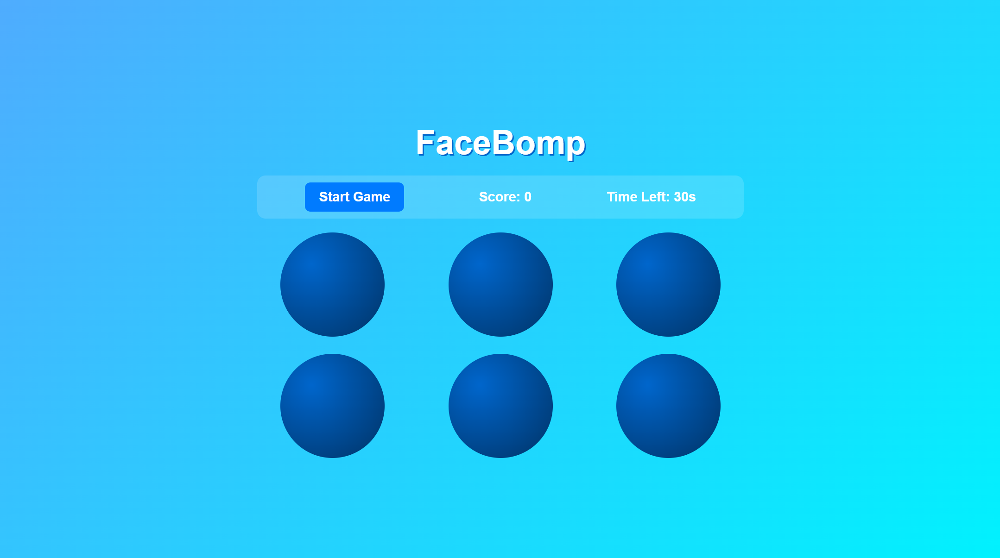

# 🚀 Learn-With-AI-Course  

  
  
  

I've completed several **Coursera Learn with AI Challenges** powered by **Scrimba** and **ChatGPT (Model: GPT-5)**, earning certification along the way.  

---

## 🏆 Highlights  
- ✅ Learned **prompt engineering** with GPT-5  
- ✅ Built real-world **AI-powered projects**  
- ✅ Earned **Certification** from Scrimba  

---

## 🌐 Projects  

### 🔹 [LumaHome](https://lumahome.netlify.app/)  
A modern AI-powered website showcasing smart home integration.  

### 🔹 [DiceRoller](https://krutarth-diceroller.netlify.app/)  
A modern AI-powered WebApp showcasing Roll the Dice.

### 🔹 Save2Shop (Chrome Extension)  
A handy browser extension to **save products while shopping online** for later comparison. *(Link coming soon!)*  

### 🔹 [Python String Operations](https://string-oppy.netlify.app/)  
A modern AI-powered WebApp showcasing Python String Operations.

### 🔹 [Antique Aces](https://krutarth-antiques-aces.netlify.app/)  
A modern AI-powered WebApp showcasing Antique Aces.

> and much more... also you can see my this GitHub Repo you will find more Mini-App Projects also you can checkout Preview images down below.

---

## 📜 Certification

### 🤖 Learn to code with AI
**Coursera • Scrimba** | *August 21, 2025* | **5 hour** | **Grade: 92.82%**
    

    
**Skills:** GitHub Copilot, AI Code Suggestions, Collaborative Development
    
[🔗 View Certificate](https://coursera.org/share/eac74da628f38c1d22b97a33b0008998) | [📖 Course Info](https://www.coursera.org/learn/learn-to-code-with-ai)

## ⚡ Tech Stack

- AI & LLMs: GPT-5
- Frontend: HTML, CSS, JavaScript
- Extensions: Chrome API
- Deployment: Netlify

## 📸 Preview

A visual gallery of my mini-apps and projects (with captions):

| Project | Project | Project |
|---|---|---|
|  <strong>Agency Hero Slider</strong>  |  <strong>Agency Hero Slider</strong>  |  <strong>Agency Hero Slider</strong>  |
|  <strong>Agency Hero Slider</strong>  |  <strong>Dice Roller</strong> Simple random dice generator with roll action. |  <strong>FaceBomp</strong> Fast-paced whack-a-mole style game with sound FX. |
|  <strong>FoodVote</strong> Compare two dishes and cast your vote. |  <strong>Homepage</strong> Clean personal landing page layout. |  <strong>LumaHome</strong> Smart home control UI; lights, security, and scenes. |
|  <strong>Save2Shop</strong> Chrome extension to save products for later. |  <strong>Slideshow</strong> Lightweight image slideshow with controls. | &nbsp; |

> ✨ Learning never stops. AI is not replacing us — it’s empowering us.

# Author

Designed & Developed By **Krutarth Raychura aka webKing021!**
